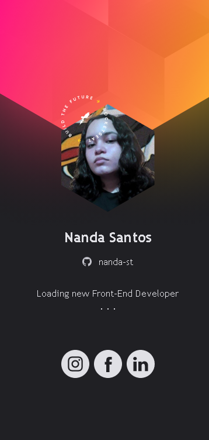
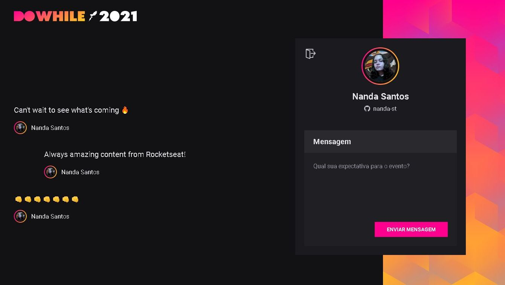
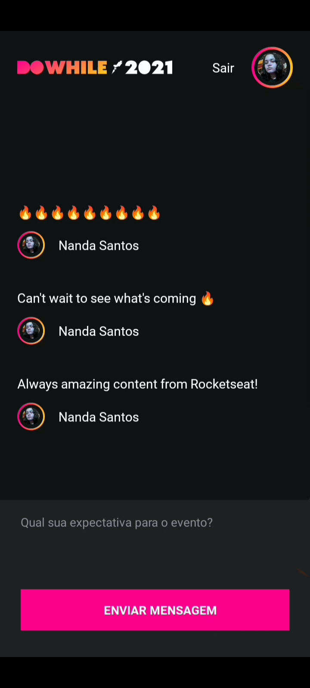

# NLW-heat

## Folders structure
```
├── nlw-heat
│   ├── nlw-heat-origin
│   └── nlw-heat-impulse
│   │   ├── backend-node
│   │   ├── frontend-react
│   │   └── frontend-reactnative
```

## NLW Heat: Origin 



```
You can switch my username or id with yours on
const socialMediaLinks = { 
  github: 'nanda-st',  
  instagram: 'nandx.9',  
  facebook: '100067007475718', 
  linkedin: 'nanda-st'  
} 
```


## NLW Heat: Impulse

## Node Backend
### How to Run
You have to register your app in Github OAuth to get Client ID and Client Secret, set callback  URL to your React Frontend application, then choose a secret for JWT and fill in `.env` file
```
GITHUB_CLIENT_ID=
GITHUB_CLIENT_SECRET=

JWT_SECRET=
```

You may also need to make another register for React Native version and set both URLs to https://auth.expo.io/@your_expo_user/frontend-reactnative

### Endpoints
|    |                                     |                                |
|----|-------------------------------------|--------------------------------|
|POST|http://localhost:4000/authenticate   |Authenticate with Github        |
|POST|http://localhost:4000/messages       |Create a new message            |
|GET |http://localhost:4000/messages/recent|Get the most recent messages (3)|
|GET |http://localhost:4000/profile        |Get user profile                |

## React Frontend
Fill in clientId on line 37 on src/contexts/auth.tsx with the same Client ID of your Node environment.
<p>


</p>

## React Native Frontend
Fill in CLIENT_ID on line 6 on src/hooks/auth.tsx with the same Client ID of your Node environment.
<p>



</p>
